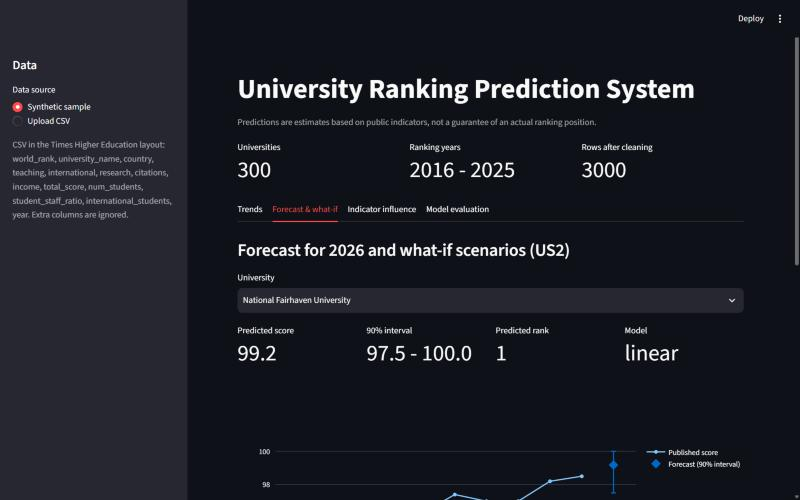
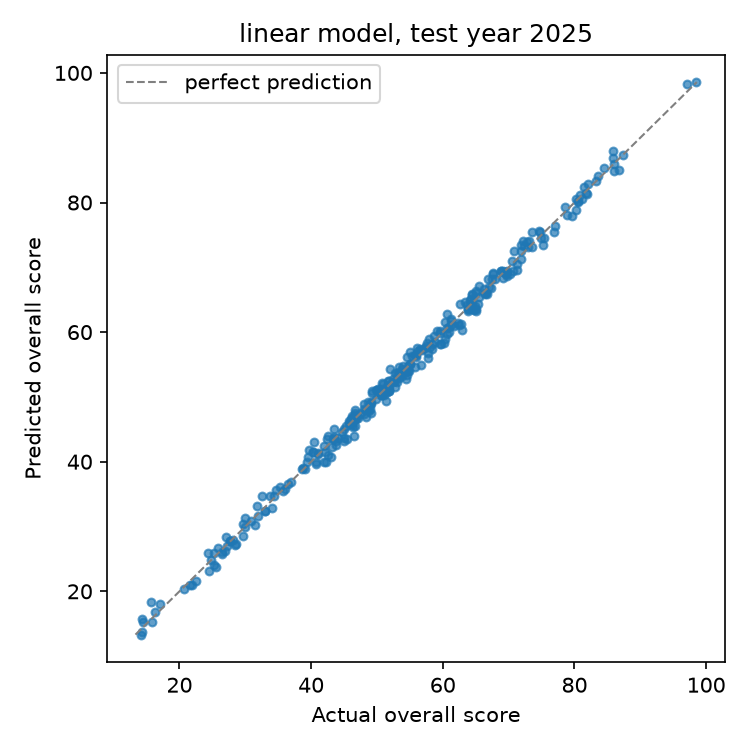
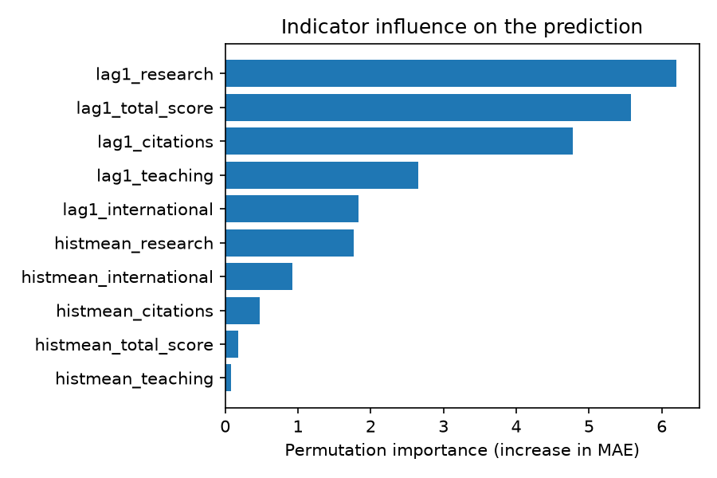

# University Ranking Prediction System (URPS)

[](https://github.com/OWNER/university-ranking-prediction/actions/workflows/ci.yml)
[](LICENSE)


A small, reproducible Python tool that turns historical university ranking tables into
**next-cycle score and rank predictions**, with uncertainty intervals and indicator influence.
It is the practical part of Assignment 3 (*Software Development and Integration*) of the Applied
Software Development course, building on the project charter, plan (Assignment 1) and architecture
(Assignment 2) of the University Ranking Prediction System.

> Predictions are estimates based on public indicators. They explain correlation, not causation,
> and are not a guarantee of any university's actual ranking.

## What it does

| Step | Module | Requirement |
|------|--------|-------------|
| Read raw THE-format CSV, parse tied ranks (`=45`), rank bands (`201-250`), `20,152`, `25%`, `-` | `urps.data` | FR1, FR2 |
| Merge name variants, drop duplicates and rows without an overall score | `urps.data` | FR2 |
| Validate the cleaned table against a declarative schema; stop on violation | `urps.schema` | NFR7 |
| Build features **only from year t-1**: lags, yearly change, 3-year trend, historical mean | `urps.features` | FR3 |
| Train a persistence baseline, linear regression and gradient boosting; temporal split | `urps.model` | FR4 |
| Report MAE, RMSE, R², 90% interval coverage; forecast next cycle with rank labels | `urps.pipeline` | FR5, FR7 |
| Permutation importance and figures | `urps.viz` | FR8, FR6 |

User stories covered: US1 (trend plots), US2 (next-cycle forecast), US3 (indicator influence).

## Quick start

```bash
git clone https://github.com/OWNER/university-ranking-prediction.git
cd university-ranking-prediction
python -m venv .venv
.venv/Scripts/activate            # Windows; `source .venv/bin/activate` on Linux/macOS
pip install -e ".[app]" -c constraints.txt
```

### Interactive dashboard

```bash
urps app
```

This opens <http://localhost:8501> with four tabs:

| Tab | What you can do | User story |
|-----|-----------------|------------|
| Trends | Compare universities over the years by overall score or any indicator | US1, FR6, FR11 |
| Forecast & what-if | Next-cycle score, 90% interval and rank; move sliders to change this year's indicators and see the effect | US2, FR5, FR9 |
| Indicator influence | Which indicators drive the prediction (permutation importance) | US3, FR8 |
| Model evaluation | MAE / RMSE / R² of all models on the held-out year, predicted vs actual, CSV export | FR7, FR10 |

The sidebar switches between the built-in synthetic sample and **your own CSV upload**
(try `data/sample/the_rankings_upload_demo.csv`, or real data, see [Data](#data)).



### Command line

Run the whole pipeline on the committed sample:

```bash
urps run --data data/sample/the_rankings_sample.csv --out reports
```

```
Test year 2025: best model = linear
  persistence  MAE=0.962  RMSE=1.179  R2=0.995
  linear       MAE=0.820  RMSE=1.008  R2=0.996
  gbm          MAE=0.899  RMSE=1.110  R2=0.996
MAE improvement over persistence baseline: 14.78%
```

Forecast one university for the next, unpublished cycle:

```bash
urps predict --data data/sample/the_rankings_sample.csv --university "National Fairhaven University"
```

```json
{
  "university": "National Fairhaven University",
  "year": 2026,
  "predicted_score": 99.18,
  "interval_90": [97.5, 100.0],
  "predicted_rank": "1",
  "model": "linear",
  "note": "Estimate based on public indicators, not a guarantee of the actual ranking."
}
```

Other commands: `urps generate` (write a new synthetic table), `urps --help`.

### Outputs of `urps run`

| File | Content |
|------|---------|
| `reports/metrics.json` | Metrics per model, best model, improvement over baseline, top features, provenance (data SHA-256, versions, seed) |
| `reports/predictions.csv` | Test-year predictions with 90% interval and predicted rank |
| `reports/forecast.csv` | Next-cycle forecast for every university |
| `reports/figures/*.png` | Predicted vs actual, feature importance, model comparison |

<p align="center">
  
  
</p>

## Data

`data/sample/the_rankings_sample.csv` is a **synthetic** table (300 universities × 10 years) generated
by `urps.synthetic`. It copies the column layout and the formatting problems of the public Times Higher
Education data, but no real ranking data is redistributed. Metrics above therefore show that the
pipeline works; they say nothing about how predictable real rankings are.

`data/sample/the_rankings_upload_demo.csv` is a smaller synthetic file (60 universities, 2019–2025)
for trying the upload feature of the dashboard.

**Real data.** The public Kaggle dataset
[World University Rankings](https://www.kaggle.com/datasets/mylesoneill/world-university-rankings)
(Times Higher Education 2011–2016) has a file `timesData.csv` with the expected layout. A free Kaggle
account is needed to download it. Put the file into `data/raw/` (git-ignored) and either upload it in
the dashboard or run `urps run --data data/raw/timesData.csv`. Universities without a published overall
score (positions below 200 in that file) are dropped automatically. The loader was written for this
layout but has not been tested on the real file in CI.

Any CSV with the columns `world_rank, university_name, country, teaching, international, research,
citations, income, total_score, num_students, student_staff_ratio, international_students, year`
works; extra columns are ignored. Respect the terms of use of the data source.

## Project structure

```
├── src/urps/            # package: data, schema, features, model, pipeline, analysis, dashboard, viz, cli, synthetic
├── tests/               # pytest suite + reference metrics for the regression test
├── data/sample/         # synthetic sample used by tests and CI
├── docs/                # technology justification and figures
├── .github/workflows/   # ci.yml (integration), release.yml (delivery)
├── pyproject.toml       # metadata, dependencies, pytest/ruff/mypy configuration
└── constraints.txt      # pinned versions for reproducible installs
```

## Testing

```bash
pip install -e ".[dev,app]" -c constraints.txt
pytest
```

The suite (89 tests, coverage gate 80%, currently ~99%) contains:

- **unit tests** for parsers and cleaning (tied ranks, bands, separators, name variants, duplicates);
- **schema tests**: out-of-range, missing target, duplicates and unexpected columns are rejected;
- **leakage tests**: lag features equal year t-1 values, history gaps are never bridged;
- **property-based tests** (Hypothesis): parser round-trips, rank labels are monotonic in score;
- **regression test**: metrics must stay within tolerance of `tests/data/reference_metrics.json`;
- **reproducibility test**: two runs with the same seed give identical metrics;
- **service tests** for forecasts and what-if scenarios;
- **dashboard smoke tests** with Streamlit's headless `AppTest` (renders, slider updates the scenario);
- **CLI tests** and doctests.

## CI/CD

| Workflow | Trigger | Stages |
|----------|---------|--------|
| [`ci.yml`](.github/workflows/ci.yml) | push to `main`, every pull request | **quality** (ruff lint + format, mypy) → **test** (Ubuntu/Windows × Python 3.11/3.12, coverage) → **smoke** (full pipeline on the sample, quality gate R² ≥ 0.85 and beats baseline, reports uploaded as artifact) |
| [`release.yml`](.github/workflows/release.yml) | tag `v*` | tag = package version check → tests → build sdist/wheel → GitHub Release with packages and reports |

`main` is protected: changes arrive through pull requests with green checks (GitHub Flow, see
[CONTRIBUTING.md](CONTRIBUTING.md)). Dependabot keeps actions and dependencies up to date.

## Technology choices

Python 3.11+, pandas, scikit-learn, pandera, matplotlib, Streamlit + Plotly, pytest + Hypothesis,
ruff, mypy, GitHub Actions. The reasoning (weighted decision matrix, alternatives considered) is in
[docs/technology-justification.md](docs/technology-justification.md).

## Limitations

- The sample data is synthetic; real ranking methodologies change over time and need per-source normalisation.
- Permutation importance of the linear model is inflated by strongly correlated features
  (e.g. last year's score and its historical mean); read it as a ranking of influence, not as effect sizes.
- The 90% interval is estimated from one held-out calibration year and is approximate.
- Not included yet (planned in the architecture of Assignment 2): MLflow tracking, DVC.

## Citation and licence

Cite via [CITATION.cff](CITATION.cff). Released under the [MIT License](LICENSE).
Author: Kulbossynov Alisher.
